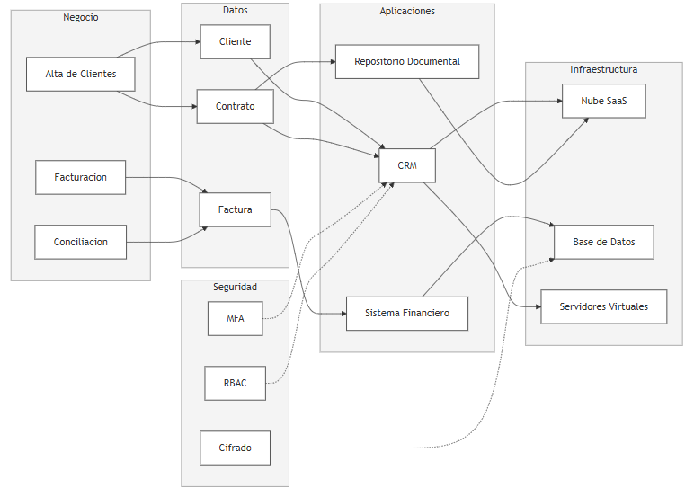

# 📄 Informe Técnico del Taller

## 🔖 Nombre del Taller
_Taller 7 – Integración de Vistas Arquitectónicas_

## 👥 Integrantes del equipo
* **Diego Ramírez** – diegorate@unisabana.edu.co  
* **Carlos Sánchez** – carlossanlo@unisabana.edu.co  
* **Mateo Vanegas** – mateovaco@unisabana.edu.co  

## 🧠 Descripción general del trabajo
El taller tuvo como propósito integrar las diferentes vistas arquitectónicas desarrolladas en el curso —negocio, información, aplicaciones, infraestructura y seguridad— dentro de una representación visual unificada que permitiera analizar sus dependencias y el aporte de cada capa al cumplimiento de los objetivos estratégicos del cliente.

El trabajo se dividió en dos etapas:  
1. El análisis en clase del caso base **FarmApp**, donde se organizó un tablero con las vistas proporcionadas por el docente.  
2. La aplicación del mismo proceso al cliente real **Tekton Tech**, consolidando la arquitectura objetivo del proyecto a partir de los entregables generados en talleres anteriores.

## 🔧 Proceso de desarrollo
El ejercicio inició con la revisión del flujo entre procesos de negocio, datos, aplicaciones e infraestructura del caso FarmApp. Este análisis sirvió como guía metodológica para estructurar el tablero final del cliente real.

Para Tekton Tech, se tomaron como referencia los artefactos construidos previamente: los procesos AS-IS y TO-BE, el modelo de datos, la propuesta de aplicaciones (CRM, sistema financiero, repositorio documental), la infraestructura en nube y el análisis de seguridad con STRIDE.  
A partir de esto, se identificaron las interrelaciones más relevantes y se sintetizaron en una versión simplificada del tablero, priorizando claridad y alineación entre capas.

El tablero final se construyó inicialmente en draw.io y luego se generó una versión consolidada en formato gráfico para incluirla como referencia dentro del repositorio.

## 🧩 Análisis del modelo propuesto
El modelo integrado se organiza en cinco capas:

**1. Negocio:** Incluye los procesos esenciales de la operación de Tekton Tech: Alta de Clientes, Facturación y Conciliación. Estos representan los flujos donde se concentra la mayor necesidad de trazabilidad y control.

**2. Datos:** Las entidades Cliente, Contrato y Factura permiten representar las relaciones de información que vinculan el CRM, la gestión financiera y la operación administrativa. Estas entidades fueron seleccionadas por ser las más críticas para soporte transaccional y documental.

**3. Aplicaciones:** Se identificaron tres aplicaciones principales: CRM, Sistema Financiero y Repositorio Documental. Estas herramientas, planteadas como soluciones SaaS, permiten estandarizar y centralizar la operación del cliente, reduciendo la dependencia de procesos manuales.

**4. Infraestructura:** La infraestructura objetivo se compone de Nube SaaS, Base de Datos y Servidores Virtuales para integraciones. Este diseño responde al enfoque de arquitectura ligera, modular y basada en servicios administrados.

**5. Seguridad:** Los controles MFA, RBAC y Cifrado se incorporan como capa transversal para atender los riesgos identificados en talleres anteriores, particularmente en relación con accesos no autorizados y protección de datos sensibles.

**Supuestos:**  
Para el diseño del tablero se asumió que Tekton operará bajo un ecosistema predominantemente SaaS, con integraciones ligeras y almacenamiento centralizado. La seguridad se consideró transversal y uniforme en todas las capas. El objetivo fue representar únicamente los componentes y relaciones más relevantes para la arquitectura TO-BE.

## 📈 Diagrama final entregado

## 🔍 Investigación complementaria

### Tema investigado:
Métodos y buenas prácticas para **integrar múltiples vistas arquitectónicas** en un único modelo coherente: *modelo 4+1 de vistas*, *ISO/IEC/IEEE 42010*, y *representaciones multinivel para arquitectura empresarial*.

### Resumen:
Para complementar el taller se revisaron enfoques ampliamente utilizados para organizar e integrar vistas arquitectónicas de manera coherente. Uno de los modelos más relevantes es el **Modelo 4+1 de Kruchten**, el cual propone separar la arquitectura en varias vistas —lógica, de procesos, de desarrollo, de infraestructura— mientras se conectan todas mediante escenarios de uso. Esta estructura permite que cada vista responda a una preocupación distinta, pero que en conjunto formen una narrativa consistente del sistema. La lógica del 4+1 coincide con el ejercicio realizado en el taller: cada capa (negocio, datos, aplicaciones, infraestructura, seguridad) cubre un aspecto distinto, pero todas deben alinearse para entender el sistema como un todo.

Asimismo, se consultó el estándar internacional **ISO/IEC/IEEE 42010**, que define cómo deben documentarse arquitecturas de software mediante *concerns*, *viewpoints* y *views*. Este estándar enfatiza que no existe “una única vista correcta”, sino que la arquitectura es un conjunto de descripciones que deben explicarse mutuamente. Este enfoque orientó la integración presentada en el tablero, asegurando que cada vista respondiera a un propósito y que se evidenciaran sus relaciones explícitamente (por ejemplo, negocio → datos, datos → aplicaciones).

Finalmente, se revisaron buenas prácticas de arquitectura empresarial basadas en marcos académicos y de industria, los cuales recomiendan (i) mantener consistencia terminológica entre vistas, (ii) evitar duplicación innecesaria de componentes, (iii) trazar siempre cómo cada vista soporta objetivos estratégicos, y (iv) representar la seguridad como una capa transversal. Estas recomendaciones fueron aplicadas directamente en la elaboración del tablero final de Tekton, garantizando que la representación fuera clara, compacta y justificada para un público técnico y no técnico.

## 📚 Referencias

[1] Kruchten, Philippe. *Architectural Blueprints—The “4+1” View Model of Software Architecture.* IEEE Software, 1995.  
[2] ISO/IEC/IEEE. *42010:2011 – Systems and Software Engineering — Architecture Description.* International Organization for Standardization, 2011.  
[3] Rozanski, Nick; Woods, Eóin. *Software Systems Architecture: Working With Stakeholders Using Viewpoints and Perspectives.* Addison-Wesley, 2012.  
[4] Buschmann, Frank et al. *Documenting Software Architectures: Views and Beyond.* Addison-Wesley, 2011.  
[5] Universidad de La Sabana. *Apuntes de clase – Arquitectura Empresarial e Integración de Vistas.* Curso AREM, 2025.

---
